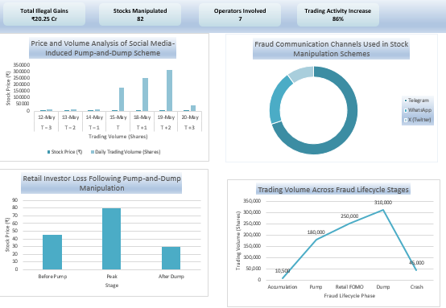

# Social Media-Driven Pump-and-Dump Detection Framework

## Capital Markets Fraud Analytics Portfolio Project

### Dashboard Preview

---

## Project Overview

A data-driven financial crime analytics framework investigating social media-driven market manipulation in the Indian stock market. Using SEBI enforcement data and Event Study Analysis, this project examines how coordinated Telegram-based stock recommendations create artificial demand, inflate prices, and result in substantial retail investor losses.

---

## Key Fraud Metrics

| Metric | Value |
|----------|----------|
| Illegal Gains | ₹20.25 Crore |
| Stocks Manipulated | 82 |
| Operators Involved | 7 |
| Trading Activity Increase | 2,852% |
| Peak Trading Volume | 310,000 Shares |
| Retail Investor Loss | 62.5% |

---

## Event Study Timeline

### T−3 to T−1 | Accumulation
Operators quietly accumulate shares while trading activity remains normal.

### T | Promotion
Stock recommendations are circulated through Telegram channels.

### T+1 | Retail FOMO
Retail investors rush to buy, pushing prices to their peak.

### T+2 | Dump
Operators sell shares into retail buying pressure.

### T+3 | Crash
Artificial demand disappears and stock prices collapse.

---

## Proactive Surveillance Framework

### Alternative Data Sourcing
Monitor Telegram and social media activity to identify suspicious stock promotions.

### Cross-Correlative Engine
Match social media alerts with abnormal trading volume and price movements.

### SME Sentinel Protocols
Deploy dynamic circuit breakers to prevent artificial liquidity creation and sudden price manipulation.

---
